# Exchanges App
A simple iOS application that displays a list of cryptocurrency exchanges and their details using the CoinMarketCap API.
This app have support to iOS 15+ and is built using Swift 6, UIKit, and follows the MVVM-C and TMA architecture.

[Figma Design](https://www.figma.com/design/OWVBNp9S0F6mbiXfdwOW9G/Exchanges-app?node-id=0-1&t=AvN5N9ABLPwF8tJy-1)

---

## 📌 Summary
- [Exchanges App](#exchanges-app)
  - [📌 Summary](#-summary)
- [Project Setup Guide](#project-setup-guide)
  - [Requirements to setup the project](#requirements-to-setup-the-project)
  - [Installation Steps](#installation-steps)
  - [Dependencies of the project](#dependencies-of-the-project)
  - [About the project structure](#about-the-project-structure)
  - [Preview](#preview)
    - [Exchange List](#exchange-list)
    - [Exchange Detail](#exchange-detail)
    - [Error](#error)
- [System Design](#system-design)
  - [Functional requirements](#functional-requirements)
  - [Non-functional requirements](#non-functional-requirements)
  - [Data Entities Definitions](#data-entities-definitions)
  - [Entity Relationship Diagram](#entity-relationship-diagram)
  - [API Endpoints](#api-endpoints)
    - [1. List Exchanges (Mapping)](#1-list-exchanges-mapping)
    - [2. Exchange Metadata](#2-exchange-metadata)
    - [3. Exchange Assets (Holdings)](#3-exchange-assets-holdings)
  - [Error Handling \& Status Codes](#error-handling--status-codes)
  - [High-Level Design (MVVM-C)](#high-level-design-mvvm-c)
    - [Architectural Components](#architectural-components)

---

# Project Setup Guide
## Requirements to setup the project
To set up the project, you will need the following tools installed on your machine:
- [Xcode 26.2+](https://xcodereleases.com/)
- [Homebrew](https://brew.sh/) (for installing dependencies)
- [RubyGems 3.6+](https://rubygems.org/) (for installing dependencies via Bundler)

## Installation Steps
1. Create API Key:
   - Sign up for a free account on [CoinMarketCap API](https://coinmarketcap.com/api/)
   - Generate an API key from the dashboard.
2. create .env file in the root of the project and add your CoinMarketCap API key:
```
    TUIST_CM_API_BASE_URL=https://pro-api.coinmarketcap.com
    TUIST_CM_API_KEY=ADD_COINMARKETCAP_API_KEY_HERE
```
3. Install dependencies:
   - Open Terminal and navigate to the project directory.
   - Run `make local-setup` to install the required project dependencies.
   - Run `make generate-project` to generate the project workspace.

## Dependencies of the project
The project uses the following dependencies:
- [Tuist](https://tuist.io/) for project generation and management.
- [Fastlane](https://fastlane.tools/) for automating build and release processes.
- [SwiftLint](https://github.com/realm/SwiftLint) for code linting and formatting.
- [xcbeautify](https://github.com/tuist/xcbeautify) for beautifying Fastlane build output.
- [Slather](https://github.com/SlatherOrg/slather) for code coverage reports.
- [Danger](https://danger.systems/) for automated code review and quality checks.
- [networkin-package](https://github.com/vitor-rc1/networking-package) SPM parckge for abstracting network layer and API calls. This package was created by me and is used in this project to handle all network requests and responses, providing a clean and modular way to interact with the CoinMarketCap API.
- [Swinject](https://github.com/Swinject/Swinject) for dependency injection, allowing for better separation of concerns and easier testing.
- [Snapshot Testing](https://github.com/pointfreeco/swift-snapshot-testing) for testing the UI components and ensuring they render correctly across different states and configurations.

## About the project structure
The project is organized into the following main directories:
- `Projects/`: Contains the Application and Features following the TMA architecture.
  - `Sources/`: Contains code and utilities used only in the module, except for modules that are shared across multiple features.
  - `Tests/`: Contains unit tests for the module.
  - `Interfaces/`: Contains protocols and interfaces that define the contract for communication between modules.
  - `Resources/`: Contains assets, storyboards, and other resources used by the module.
  - `Testing/`: Contains test utilities and mocks used for unit testing to use between modules.
-  `Tuist/`: Contains the Tuist configuration files for project generation.
-  `fastlane/`: Contains Fastlane configuration files for automating build and release processes.
-  `scripts/`: Contains custom scripts for setup, build, and other tasks.

Using the TMA architecture, the project is organized into modules that represent different features of the app. Each module is self-contained and can be developed and tested independently, promoting separation of concerns and modularity. It's common to only have public code and concrete, but this bring a problem with tests, because we have to create duplicates spies and mocks for each module, so we have a shared Testing folder to avoid this problem. Below is a diagram illustrating the project structure and dependencies between modules:

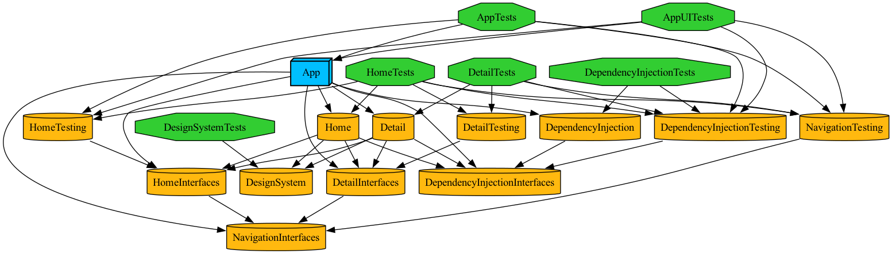

The use of Tuist allows for easy project generation and management, while Fastlane automates the build and release processes, ensuring a smooth development workflow. SwiftLint helps maintain code quality and consistency across the codebase.

The modules consist of:
- **App:** The main application module that contains the app delegate, scene delegate, and the main coordinator responsible for navigation.
- **Home:** The feature module responsible for displaying the list of cryptocurrency exchanges.
- **Detail:** The feature module responsible for displaying the details of a specific exchange.
- **DependencyInjection:** A shared module that contains the dependency injection container and related configurations. This module is used to manage dependencies across the app and features, ensuring a clean separation of concerns and easier testing.
- **DesisgnSystem:** A shared module that contains reusable UI components, styles, and assets. This module promotes consistency across the app and allows for easy maintenance of the design system.
- **Navigation:** A shared module that contains navigation-related components and utilities, such as coordinators and navigation controllers. This module helps centralize navigation logic and promotes a clean separation of concerns.

## Preview
<details>
  <summary><b>📸 Screenshots</b></summary>
The app consists of two main screens: the Exchange List and the Exchange Detail. Below are screenshots of each screen:

### Exchange List

<table>
  <tr>
    <td align="center">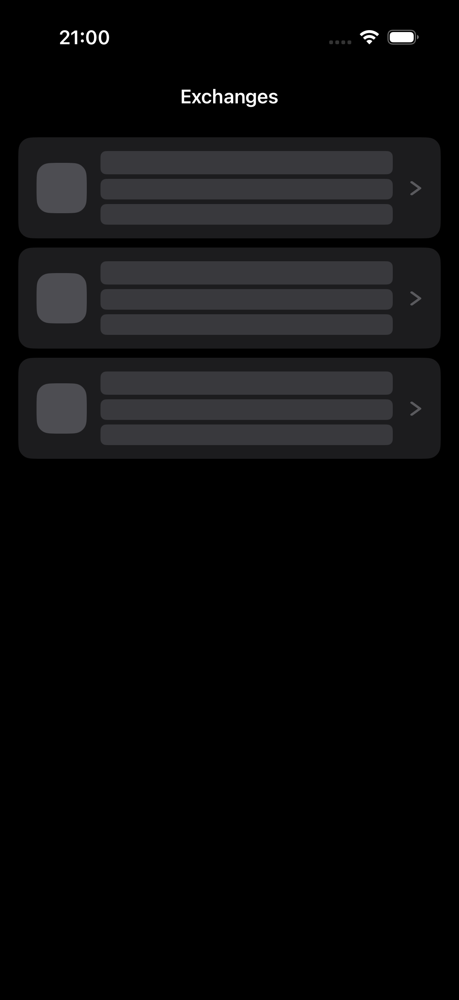</td>
    <td align="center">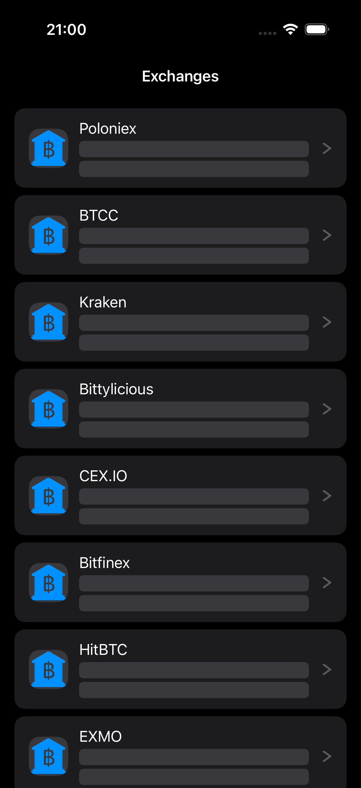</td>
    <td align="center">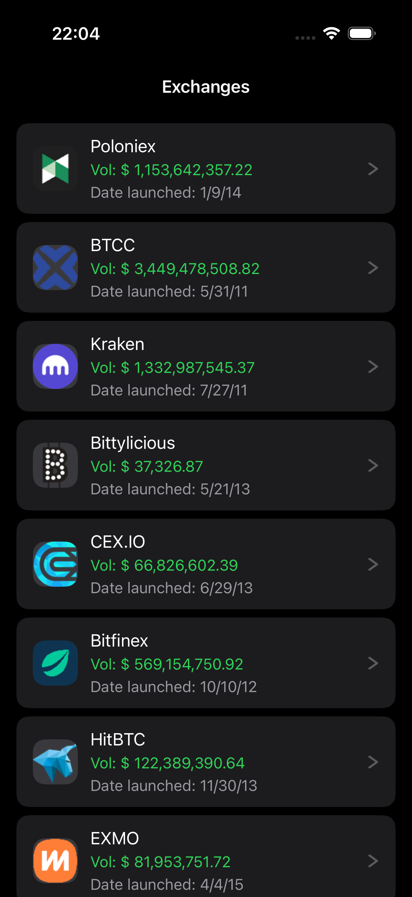</td>
  </tr>
  <tr align="center">
    <td>Loading</td>
    <td>Pre loaded</td>
    <td>Loaded</td>
  </tr>
  <tr align="center">
    <td colspan="3"><b>Dark</b></td>
  </tr>
</table>

<table>
  <tr>
    <td align="center">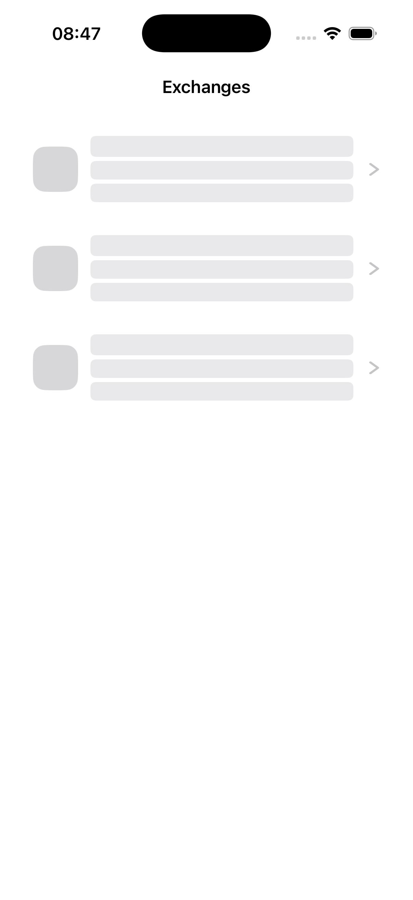</td>
    <td align="center">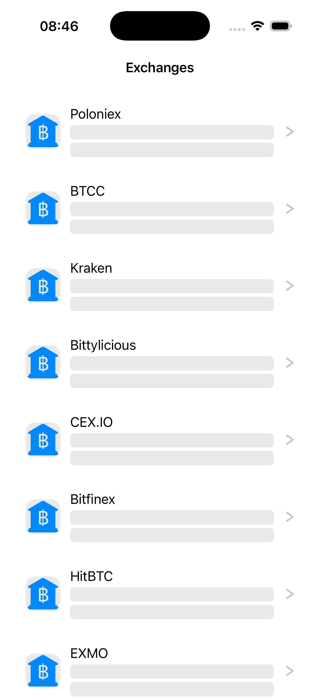</td>
    <td align="center">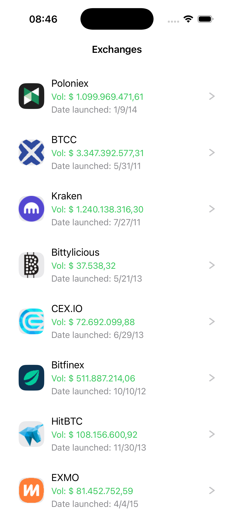</td>
  </tr>
  <tr align="center">
    <td>Loading</td>
    <td>Pre loaded</td>
    <td>Loaded</td>
  </tr>
  <tr align="center">
    <td colspan="3"><b>Light</b></td>
  </tr>
</table>

### Exchange Detail
<table>
  <tr>
    <td align="center">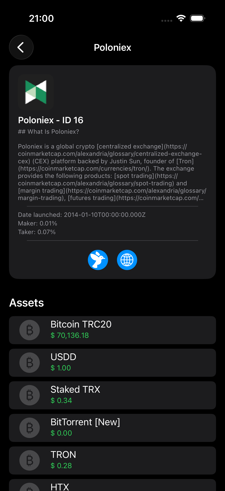</td>
    <td align="center">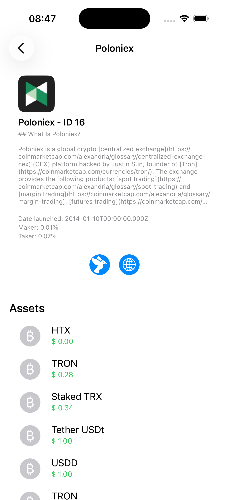</td>
  </tr>
  <tr align="center">
    <td>Detail Dark</td>
    <td>Detail Light</td>
  </tr>
</table>

### Error
<table>
  <tr>
    <td align="center">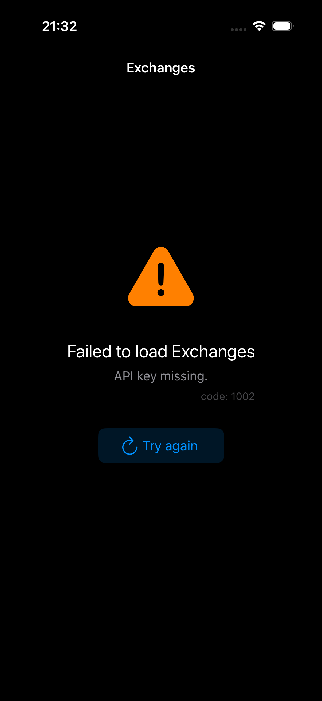</td>
    <td align="center">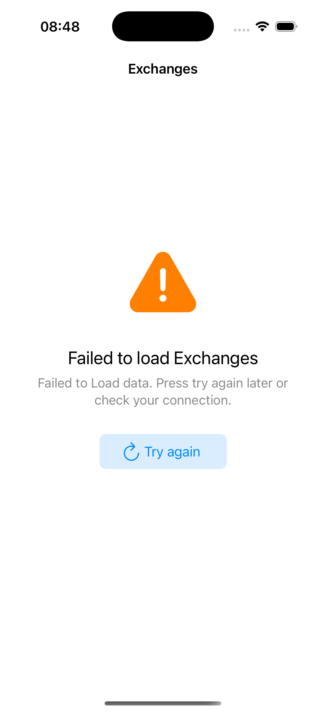</td>
  </tr>
  <tr align="center">
    <td>Error Dark</td>
    <td>Error Light</td>
  </tr>
</table>
</details>

# System Design
## Functional requirements
- **User can:**
  - view a list of cryptocurrency exchanges.
  - view details of a specific exchange.
  - visit the exchange's website and twitter when have url
  - view the app in light and dark mode
  - view a loading indicator while data is being fetched
  - view an error message if data fetching fails
  - retry fetching data if an error occurs
  
## Non-functional requirements
- **The app:**
    - should have a clean and user-friendly UI.
    - should be responsive and work on different screen sizes.
    - should be performant and load data quickly.
    - should consider scalability for future features and enhancements.
    - should follow best practices for iOS development.
    - should support iOS 15 and later.
    - should be built using Swift 6 and UIKit.
    - should follow the MVVM-C architecture for better separation of concerns and testability.

## Data Entities Definitions
- **PreLoadedExchanges:** A list of exchanges with basic information (id, name) that is preloaded in the app for quick access.
- **Exchange:** Represents a cryptocurrency exchange with basic details such as id, name, spot volume in USD, date launched, and logo.
- **ExchangeDetail:** Represents detailed information about a specific exchange, including description, fees, weekly visits, and associated assets.
- **ExchangeURLs:** Contains various URLs related to the exchange, such as website, social media links, and fee information.
- **Assets:** Represents assets traded on the exchange, including id, name, symbol, and price in USD.
- **Status:** Represents the status of the API response, including timestamp, error code, error message, elapsed time, and credit count.

## Entity Relationship Diagram


## API Endpoints

The application integrates with CoinMarketCap API using the following service layer endpoints:

### 1. List Exchanges (Mapping)
`GET /v1/exchange/map`
- **Purpose:** Retrieves a lightweight list of list of exchanges.
- **Usage:** Used during the Bootstrap/Pre-loading phase to map exchange names to IDs and populate selection components.
- **Key Response:** PreLoadedExchanges entity.

### 2. Exchange Metadata
`GET /v1/exchange/info?id={ids}`

- **Purpose:** Fetches comprehensive metadata for one or more exchanges.
- **Usage:** Powers the Exchange Detail view, providing logos, descriptions, and official website URLs.
- **Parameter:** Supports a comma-separated list of IDs (e.g., id=1,2,3).
- **Key Response:** ExchangeDetail entity.

### 3. Exchange Assets (Holdings)
`GET /v1/exchange/assets?id={id}`

- **Purpose**: Returns the asset holdings (Proof of Reserves) for a specific exchange.
- **Usage:** Displays the Token Composition within the exchange details, including wallet addresses and balances across different blockchains.
- **Key Response:** List of Assets entities.

## Error Handling & Status Codes
The system maps API responses to specific application states. Below are the handled HTTP status codes:

| Status Code | Label | Description |
| :--- | :--- | :--- |
| **401** | Unauthorized | API Key is missing or invalid. |
| **403** | Forbidden | The IP is blacklisted or the API Key lacks required permissions. |
| **429** | Too Many Requests | Rate limit exceeded. The system implements a back-off strategy. |
| **500** | Internal Server Error | CoinMarketCap server-side issue. |

- **Key Response:** Status entity.

## High-Level Design (MVVM-C)
The application architecture is based on the MVVM-C (Model-View-ViewModel + Coordinator) pattern. This approach ensures a clear separation of concerns, improves testability, and centralizes navigation logic.

### Architectural Components
- **Coordinator:** The "brain" of navigation. It removes the responsibility of flow control from View Controllers, making them independent and reusable. It handles the instantiation of ViewControllers and ViewModels.
- **ViewModel:** Acts as a mediator between the Model and the View. It holds the business logic, formats data for display, and is completely unaware of the UI framework (UIKit/SwiftUI), which makes it ideal for Unit Testing.
- **View (ViewController):** Responsible only for layout and capturing user interactions. It binds to the ViewModel to receive updates.
- **Service / API:** Handles all network requests and responses, abstracting the details of API communication.

Model: Represents the data structures and the business logic layer (Repositories and Services).

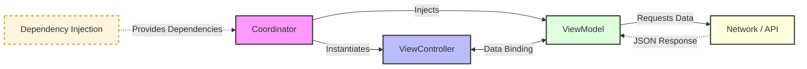