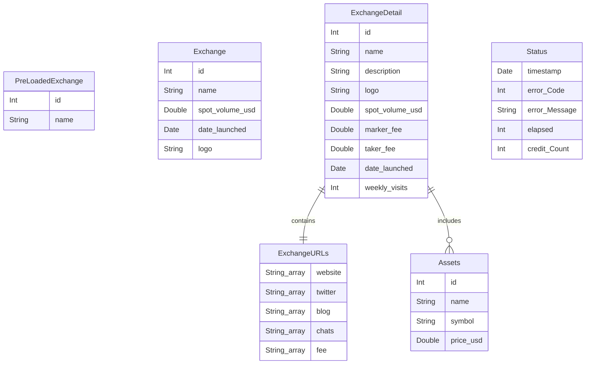
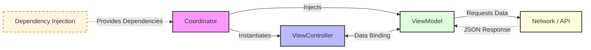

# exchanges-app
A simple iOS application that displays a list of cryptocurrency exchanges and their details using the CoinMarketCap API.

## Functional requirements
- **User can:**
  - view a list of cryptocurrency exchanges.
  - view details of a specific exchange.
  - view details of a specific exchange using deeplinks
  - visit the exchange's website from the app
  - view the app in light and dark mode
  - view a loading indicator while data is being fetched
  - view an error message if data fetching fails
  - retry fetching data if an error occurs
  
## Non-functional requirements
- **The app:**
    - should have a clean and user-friendly UI.
    - should be responsive and work on different screen sizes.
    - should be performant and load data quickly.
    - should consider scalability for future features and enhancements.
    - should follow best practices for iOS development.

## Data Entities Definitions
- **PreLoadedExchanges:** A list of exchanges with basic information (id, name) that is preloaded in the app for quick access.
- **Exchange:** Represents a cryptocurrency exchange with basic details such as id, name, spot volume in USD, date launched, and logo.
- **ExchangeDetail:** Represents detailed information about a specific exchange, including description, fees, weekly visits, and associated assets.
- **ExchangeURLs:** Contains various URLs related to the exchange, such as website, social media links, and fee information.
- **Assets:** Represents assets traded on the exchange, including id, name, symbol, and price in USD.
- **Status:** Represents the status of the API response, including timestamp, error code, error message, elapsed time, and credit count.

## Entity Relationship Diagram

## API Endpoints

The application integrates with CoinMarketCap API using the following service layer endpoints:

### 1. List Exchanges (Mapping)
`GET /v1/exchange/map`
- **Purpose:** Retrieves a lightweight list of list of exchanges.
- **Usage:** Used during the Bootstrap/Pre-loading phase to map exchange names to IDs and populate selection components.
- **Key Response:** PreLoadedExchanges entity.

### 2. Exchange Metadata
`GET /v1/exchange/info?id={ids}`

- **Purpose:** Fetches comprehensive metadata for one or more exchanges.
- **Usage:** Powers the Exchange Detail view, providing logos, descriptions, and official website URLs.
- **Parameter:** Supports a comma-separated list of IDs (e.g., id=1,2,3).
- **Key Response:** ExchangeDetail entity.

### 3. Exchange Assets (Holdings)
`GET /v1/exchange/assets?id={id}`

- **Purpose**: Returns the asset holdings (Proof of Reserves) for a specific exchange.
- **Usage:** Displays the Token Composition within the exchange details, including wallet addresses and balances across different blockchains.
- **Key Response:** List of Assets entities.

## Error Handling & Status Codes
The system maps API responses to specific application states. Below are the handled HTTP status codes:

| Status Code | Label | Description |
| :--- | :--- | :--- |
| **401** | Unauthorized | API Key is missing or invalid. |
| **403** | Forbidden | The IP is blacklisted or the API Key lacks required permissions. |
| **429** | Too Many Requests | Rate limit exceeded. The system implements a back-off strategy. |
| **500** | Internal Server Error | CoinMarketCap server-side issue. |

- **Key Response:** Status entity.

## High-Level Design (MVVM-C)
The application architecture is based on the MVVM-C (Model-View-ViewModel + Coordinator) pattern. This approach ensures a clear separation of concerns, improves testability, and centralizes navigation logic.

### Architectural Components
- **Coordinator:** The "brain" of navigation. It removes the responsibility of flow control from View Controllers, making them independent and reusable. It handles the instantiation of ViewControllers and ViewModels.
- **ViewModel:** Acts as a mediator between the Model and the View. It holds the business logic, formats data for display, and is completely unaware of the UI framework (UIKit/SwiftUI), which makes it ideal for Unit Testing.
- **View (ViewController):** Responsible only for layout and capturing user interactions. It binds to the ViewModel to receive updates.
- **Network / API:** Handles all network requests and responses, abstracting the details of API communication.

Model: Represents the data structures and the business logic layer (Repositories and Services).

